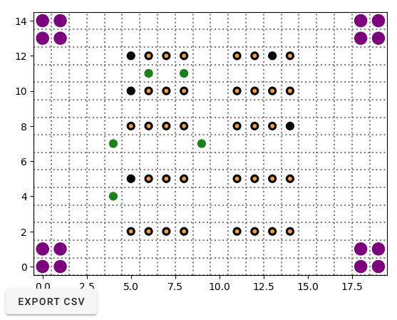

# Multi-Agent Warehouse Simulation
This project simulates autonomous warehouse robots operating in a grid-based environment using various task coordination strategies. Built using the Mesa framework, it allows for interactive visualization, batch experiments, and in-depth performance analysis using statistical tools.



## Features
- Simulates autonomous agents (robots) that pick up and deliver shelf items in a warehouse.
- Supports multiple task assignment strategies:
  - centralised – global assignment using the Hungarian algorithm.
  - decentralised – proximity-based bidding.
  - swarm – local clustering and exploration with pheromone cues.
- Models pathfinding, collision avoidance, and pheromone trail dynamics.
- Provides a Solara-based GUI for interactive exploration.
- Includes batch experiment scripts and statistical analysis tools to assess performance (e.g., throughput, efficiency, collision rates).

## Simulation Overview
Agents operate within a customizable warehouse layout containing:
- Shelf items to pick up
- Drop zones to deliver to
- Static obstacles (shelves)
- Dynamic decision-making based on path planning, reservations, and task state
Each agent follows a finite state machine:
```
idle → to_pickup → to_dropoff → relocating → idle
```

## Installation & Execution

### 1. Installation
```
# Create virtual environment
python -m venv venv
source venv/bin/activate  # or .\venv\Scripts\activate on Windows

# Install dependencies
pip install -r requirements.txt
```
Dependencies include: mesa, solara, pandas, matplotlib, seaborn, scipy, statsmodels, numba, tqdm.

### 2. Run Interactive GUI
``` solara run app.py ```

This will launch a visual interface allowing you to:
- Adjust warehouse parameters (size, agent count, strategy)
- Watch agent behavior live
- Export metrics to results.csv for further analysis

### 3. Run Batch Simulations
```
python run_experiments.py
```

This will:
- Sample a diverse set of parameter configurations
- Run 30 iterations per configuration across multiple CPU cores
- Save aggregated results to batch_results.csv

### 4. Analyze Results
```
python analysis.py batch_results.csv --output_dir analysis_plots
```

Generates:
- Boxplots and confidence intervals
- ANOVA + Tukey HSD comparisons
- Cohen's d effect sizes
- Correlation/regression analyses
- Composite efficiency index
All plots and summaries are saved in the analysis_plots/ directory.

## Testing
To run basic functional tests of the pathfinding and reset logic:
```
python test_model.py
```

## Project Structure

| File | Purpose |
| ---- | ------- |
| ```model.py``` | Core simulation logic and coordination strategies |
| ```agent.py``` | Definitions for shelf, robot and item agents |
| ```app.py``` | GUI using Solara & Mesa |
| ```run_experiments.py``` | Parallel batch simulation runner |
| ```analysis.py``` | Statistical and visual analysis pipeline |
| ```test_model.py``` | Unit tests for pathfinding and model state |
| ```results.csv``` | Output from GUI-based simulation |
| ```batch_results.csv``` | Output from batch experiments |

## Metrics Tracked
- Total Deliveries
- Collisions
- Steps per Delivery
- Pending Tasks
- Congestion (spatial heatmap)
- Composite Efficiency Index
